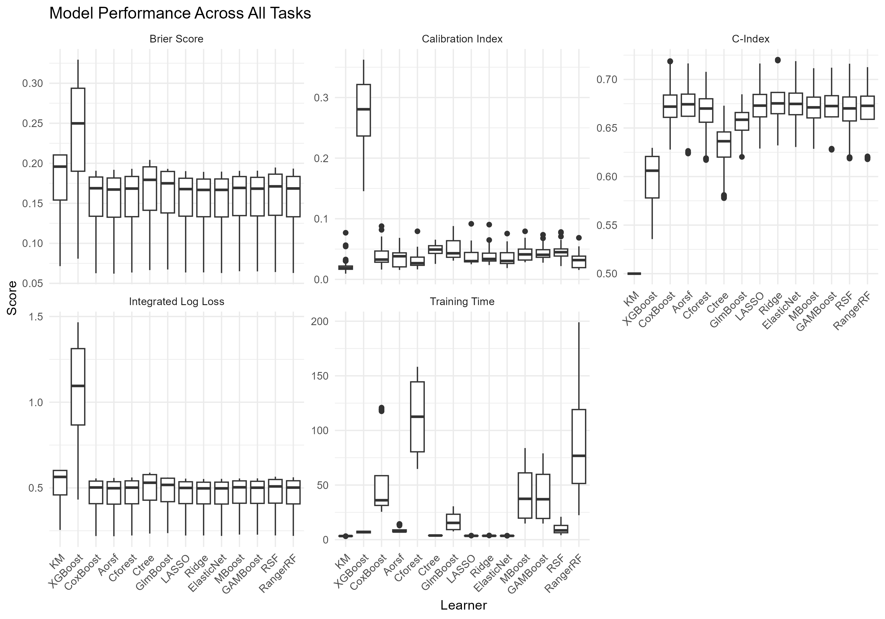

# TTE-aging-benchmark
This GitHub page contains the code and results for a benchmark comparison of time-to-event outcomes in aging. It accompanies the submitted paper: Comparative Evaluation of Time-to-Event Analysis Methods for Mobility Limitation in Older Adults: A Multi-Cohort Benchmarking Study

Author list: To be added after the paper is accepted for publication. 

## Abstract
Background: Time to event models are central to aging research, yet guidance on selecting among traditional statistical and machine learning (ML) methods for prediction modeling remains limited, particularly for epidemiologic aging cohorts with wide assessment intervals. Mobility limitation is a clinically important aging outcome with such complexities, providing a relevant test case for methodological benchmarking.

Methods: We conducted a systematic benchmark comparison of 14 statistical and ML time-to-event methods using harmonized data from four longitudinal U.S. aging cohorts (N = 14,582). The outcome was time to incident mobility limitation, defined by self reported walking difficulty or gait speed < 0.8 m/s. Models were evaluated using 4 fold cross validation repeated 100 times within cohorts. Performance metrics captured complementary dimensions of predictive quality: discrimination (C index), accuracy and calibration (Brier score, integrated log loss, calibration index), and computational efficiency (training time). Prespecified decision rules synthesized results across metrics to identify preferable methods.

Results: Across pooled analyses, multiple methods demonstrated comparable discrimination, including penalized Cox models, tree based ensembles, and boosting approaches. Elastic net Cox regression achieved the most favorable overall trade off, combining high discrimination, good calibration, low prediction error, and the fastest training times. When computational efficiency was deprioritized, accelerated oblique random survival forests, conditional inference forests, and random survival forests were also competitive.

Conclusions: In aging cohort data, regularized Cox models, particularly elastic net, may be preferable compared to other methods. These findings support penalized regression as a strong default strategy for time-to-event prediction modeling in gerontologic research and highlight the importance of joint evaluation of discrimination, calibration, and feasibility.

## Code Files
-Summarize Datasets: contains code for pulling in the data and summarizing the data overall and by cohort

-Benchmarking: contains code for running the benchmark analysis with the mlr3 ecosystem

-Analysis of Results: contains code for pulling the saved results files and aggregating and presenting results

## Figure 1 

Overview of the benchmark analysis pipeline implemented using the mlr3 ecosystem. 

Data were preprocessed prior to modeling, followed by repeated cross validated model training and evaluation using discrimination, accuracy, calibration, and computational efficiency metrics. Preferable methods were selected based on prespecified criteria prioritizing high C index, good calibration, and low training time.

## Figure 2

Boxplots of overall model performance across evaluation metrics. 

Distributions summarize results aggregated across cohorts and replications for discrimination (C index), accuracy and calibration (Brier score, integrated log loss, calibration index), and computational efficiency (training time). Preferable methods are those with high C-index and low Brier score, integrated log loss, calibration index, and training time. 

